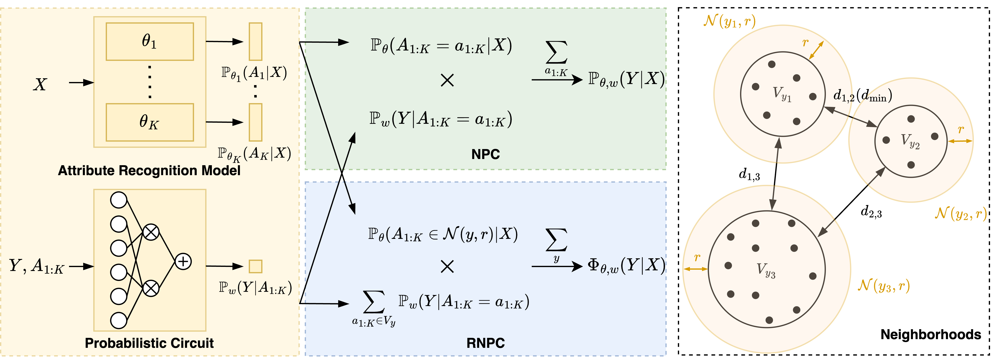

# RNPC

This repository contains the official implementation of the NeurIPS 2025 paper *"Understanding and Improving Adversarial Robustness of Neural Probabilistic Circuits"*.



## Environment Setup

To create the required environment, run:

```bash
conda env create -f environment.yml
```

Then activate it with:

```bash
conda activate rnpc
```

## Dataset Preparation

Download the datasets from [Google Drive – RNPC datasets](https://drive.google.com/drive/folders/1pYwPLDyUYJrGMI89ryHRDTTxff50sHAr?usp=sharing), and save them in the root directory of this repository.

## Attack preparation

Download the [Adversarial-Attacks-PyTorch](https://github.com/Harry24k/adversarial-attacks-pytorch) repository and save it under `./visat-models`. 

Some modifications are required to adapt the attacks for the attribute recognition model, which outputs predictions for multiple attributes. Specifically, replace the files `pgd.py`, `pgdl2.py`, and `cwbs.py`  under `adversarial-attacks-pytorch/torchattacks/attacks` with the ones provided in our repository.

## Training

```
cd visat-models/scripts
```

To train the attribute recognition model, run:

```bash
./train_attr.bash
```

To train the probabilistic circuit, please use the repository of the LearnSPN paper to generate the structure of the probabilistic circuit first, which is saved as a `.txt` file. Then, run:

```bash
./train_spn.bash
```

To train the baseline models, run:

```
./train_reference.bash
```

You can also download the checkpoints of these models from [Google Drive – RNPC_checkpoints](https://drive.google.com/drive/folders/1P-ORACRwH_MLw0dVAWx75BXwdE6-_hE0?usp=sharing).

## Inference

To evaluate the benign & adversarial performance of different models on various datasets, run:

``` 
cd visat-models/scripts
./mnist_dim_3_min_3_noise_1.bash
./mnist_dim_5_min_5_noise_1.bash
./celeba_dim_8_min_4.bash
./gtsrbsub.bash
```

## Acknowledgments

This code builds upon the repository of the paper *"Neural Probabilistic Circuits: Enabling Compositional and Interpretable Predictions through Logical Reasoning"*.
